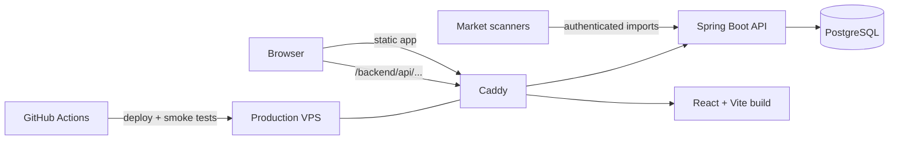

# Metin2 Bazar

A production web application for searching and comparing Metin2 marketplace listings across **Pandora**, **Elder**, and **Beavium**.

**Live:** [metin2bazar.pl](https://metin2bazar.pl) · **Backend:** [mazikox/metin2-market-api](https://github.com/mazikox/metin2-market-api)

[](https://github.com/mazikox/metin2-market-web/actions/workflows/deploy.yml)


> Independent community project. Not affiliated with Gameforge.

## Why this project

Checking item prices manually across Metin2 shops is slow and makes it difficult to compare offers consistently. Metin2 Bazar turns market scan data into a searchable catalog where players can compare prices, quantities, bonuses, shop locations, and price statistics in one place.

The project is deployed as a real production service rather than a static portfolio demo. It includes a separate backend, PostgreSQL persistence, reverse-proxy routing, technical SEO, CI/CD, post-deployment smoke tests, and privacy-conscious usage statistics.

## Product features

- **Market overview** — eight item cards with tabs for unique shop count or total item quantity in the latest published scan, with minimum prices, quantities, scan date, and direct access to offers.
- **Multi-server marketplace** — separate catalogs for Pandora, Elder, and Beavium.
- **Fast item search** — API-backed suggestions, exact VNUM families, and debounced requests.
- **Offer comparison** — unit prices, quantities, bonuses, shop data, channel/map information, and observation timestamps.
- **Market statistics** — minimum, mean, and median prices with a local fallback when the statistics endpoint is unavailable.
- **Sorting and filtering** — price and quantity sorting across all matching offers before pagination; map filtering for the currently loaded page.
- **Saved searches** — favorites stored locally per server.
- **Resilient network UX** — request cancellation, timeouts, retry handling, stale-request protection, and user-facing API states.
- **Responsive and accessible UI** — keyboard-friendly navigation, skip links, semantic labels, and mobile navigation.

## Engineering highlights

### Server-aware routing and SEO

The public homepage is a server selector, while each market has its own canonical URL:

```text
/                    -> server selection
/?server=pandora     -> Pandora market
/?server=elder       -> Elder market
/?server=beavium     -> Beavium market
```

The production build generates server-specific HTML entry points so crawlers receive the correct `<title>`, description, Open Graph metadata, and canonical URL **before JavaScript executes**. Caddy maps the public query-string routes to those generated documents.

The site also ships with:

- generated `robots.txt` and `sitemap.xml`,
- canonical URLs for indexable pages,
- real HTTP 404 responses instead of an SPA fallback for unknown paths,
- static information/privacy pages,
- a noindex compatibility mirror for the previous domain,
- automated raw-HTTP checks for routing and canonical metadata.

### Production CI/CD

Every push to `main` runs the frontend deployment pipeline:

1. install dependencies,
2. run automated tests,
3. build the production bundle,
4. publish the release to the VPS,
5. run a production smoke test against `https://metin2bazar.pl`.

The backend repository manages the Spring Boot service and production Caddy configuration, including validation, reloads, health checks, and routing verification.

### Privacy-conscious analytics

Catalog usage statistics are collected without third-party analytics scripts, advertising trackers, cookies, or persistent analytics identifiers. Search/result request tokens exist only for the lifetime of an in-memory action. Favorites are a separate user-facing feature stored locally in the browser.

## Architecture



The frontend and backend are intentionally separated:

- this repository owns the **React application, SEO generation, frontend tests, and frontend deployment**;
- [metin2-market-api](https://github.com/mazikox/metin2-market-api) owns the **Spring Boot API, PostgreSQL/Flyway model, protected scanner imports, Caddy configuration, and backend deployment**.

## Tech stack

| Area | Technology |
| --- | --- |
| Frontend | React 18, TypeScript, Vite 5 |
| Backend | Spring Boot 4.1.1, Java 26 |
| Database | PostgreSQL, Flyway |
| Infrastructure | Caddy, Docker, Linux VPS |
| CI/CD | GitHub Actions, SSH deployment |
| Testing | Node test runner, backend integration tests with Testcontainers, production HTTP smoke tests |
| SEO | server-specific pre-rendered metadata, canonical URLs, sitemap, robots, real 404s |

## Frontend structure

```text
src/
├── components/          reusable UI components
├── App.tsx              marketplace application
├── ServerLanding.tsx    server selection landing page
├── api.ts               API client, cancellation and timeout handling
├── servers.ts           server routing helpers
├── useFavorites.ts      per-server browser favorites
└── styles.css           application styling

content/                  static information-page content
scripts/
├── generate-site.mjs    static pages, robots.txt and sitemap generation
└── smoke-test.mjs       production routing/SEO smoke test
tests/                    frontend and generated-site tests
vite.config.ts            build-time server HTML generation
```

## Run locally

### Requirements

- Node.js 22+
- npm
- optional: the backend running locally on port `8080`

### Setup

```bash
git clone https://github.com/mazikox/metin2-market-web.git
cd metin2-market-web
npm ci
cp .env.example .env
npm run dev
```

By default, development requests to `/backend` are proxied to:

```text
http://127.0.0.1:8080
```

You can override the backend target in `.env`:

```env
VITE_API_BASE_URL=/backend
VITE_API_PROXY_TARGET=http://127.0.0.1:8080
```

## Tests and build

Run the frontend test suite:

```bash
npm test
```

Create a production build:

```bash
npm run build
```

Preview the generated bundle:

```bash
npm run preview
```

Run the raw HTTP production smoke test:

```bash
npm run smoke-test -- https://metin2bazar.pl
```

The smoke test verifies the public market routes, HTTP status codes, titles, and canonical URLs before client-side JavaScript is executed.

## Data model and freshness

Listings come from published market scans. A result represents an **observed offer**, not a guarantee that the shop is still active at the moment the page is viewed.

The backend keeps server data isolated and exposes server-specific search, suggestion, and statistics endpoints. Scanner imports are authenticated and deduplicated before observations are persisted.

## Related repository

### [metin2-market-api](https://github.com/mazikox/metin2-market-api)

Spring Boot / Java backend responsible for:

- authenticated market-scan imports,
- server-specific search APIs,
- price statistics,
- PostgreSQL persistence and Flyway migrations,
- protected private catalog statistics,
- Caddy production routing,
- Docker-based deployment and integration tests.


### Map markets and scan administration

`/admin/scans` uses the same production Caddy login as `/admin/stats`. Select a
server, enable/disable maps and choose automatic newest scan or pin a ready older
scan. Save applies all changed selections together. History includes pending and
unpublished scans, which cannot be selected. The API keeps scans and settings
separate, so new imports cannot re-enable hidden maps or undo pinned selections.

The public page has one expandable **Filtry** panel with tabs for extra bonuses,
category/required level, and maps. Drafts survive tab changes and the shared apply
button submits all conditions together. Map filtering covers the whole result in
SQL, including pagination and price statistics. Options list active maps only;
empty map selection means all active maps. Base item properties remain outside
the extra bonus filter. Overview shows the date per active map.

For a local admin preview only, start API with a test `ANALYTICS_PROXY_TOKEN`
(at least 32 characters) and Vite with matching `DEV_ADMIN_PROXY_TOKEN`.
This optional proxy header injection only works in serve mode against loopback
API targets, never in production builds. The value has no `VITE_` prefix and
is not included in frontend assets. Production continues to require Caddy login.
